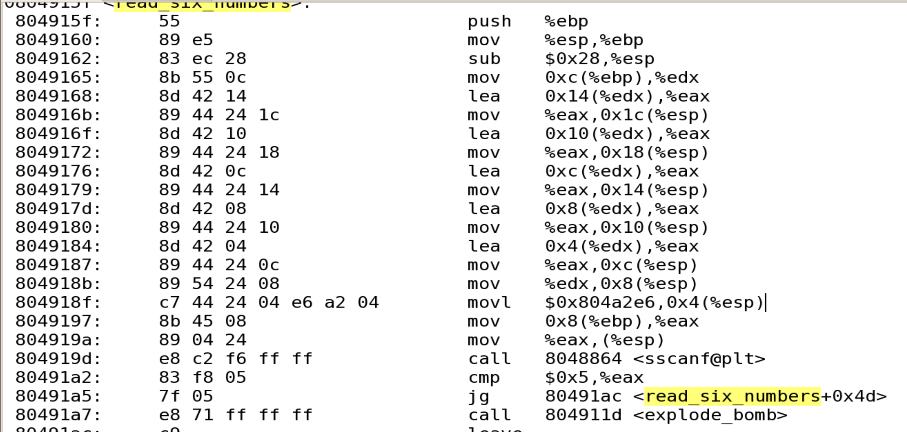
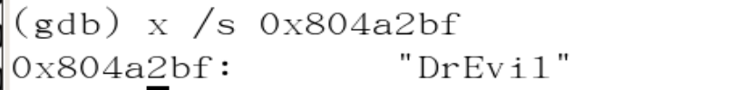

                                                                        **Bomb逆向破解**

**一、实验目的：**

综合掌握程序的机器级表示以及汇编逆向调试过程。

**二、实验内容：**

二进制炸弹是作为一个目标代码文件提供给学生们的程序，运行时，它提示用户输入6个不同的字符串。如果其中任何一个不正确，炸弹就会“爆炸”：打印出一条错误信息。学生通过反汇编和逆向工程来确定是哪六个字符串，从而解除他们各自炸弹的雷管。

该作业需要有比较好的汇编语言阅读能力，涉及理论课第3章的所有知识内容。

该作业每个同学都需要做，满分是120分，每个关卡的分数根据难易程序不一样。

**三、实验步骤：**

逆向破解完整过程，需截图展示。

objdump反编译bomb:

进入主程序，在bomb中搜索main，主程序很长，我们只需要找到和我们的phase相关的代码即可：

在每次读入数字后接着就是关卡调用phase系列的函数，这一类函数中可能会引起炸弹爆炸，所以在每次读入后需要在phase的地方设置断点，以防炸弹爆炸；在处理好phase后都会有一个phase_defused的函数，表明炸弹已经成功拆除。

## 第1关

汇编代码分析：

查看phase_1的汇编代码，首先是开辟栈帧，从前面main函数可以知道程序读入了字符串，且保存在EBP+8内，strings_not_equal函数用于比较传入的两个参数是否相等，若不相等，EAX为1，很显然题目要求不相等的时候跳转到bomb函数即炸弹爆炸，那么不相等的时候，炸弹拆除。

传入的两个参数一个为输入的参数，另一个根据第四行可以知道在内存单元0x0804a224内。

进入gdb查看0x0804a224中的内容：

所以答案为And they have no disregard for human life.

对应C语言伪代码：

答案：And they have no disregard for human life.

通关证明：

## 第2关

汇编代码分析：

读入六个数，若不是六个数字，则炸弹爆炸。

首先开辟phase_2栈帧，结合\<read_six_numbers\>我们可以推出输入的六个数存在首地址为的连续六个地址的数组内。假设数组为int a[6].

数组第一个元素和1比较，若不为1，则炸弹爆炸，说明输入的第一个数字是1.

此处是一个for循环，循环变量i在EBX中，初值为2，首先取出a[i-2]的值，即a[0]，给EAX，EAX再乘2，将这个值与a[i-1]比较，若不相等则炸弹爆炸。i的终值是6，最后比较的是a[5]是否等于两倍a[4].说明这一个循环的作用是判断数组里面的元素是否满足一个首项是1，公比为2的等比数列。

对应C语言伪代码：

答案：1 2 4 8 16 32

通关证明：

## 第3关

汇编代码分析：

首先，注意到将一个立即数给ESP+4，

进入GDB查询这个内存：，结合下面的的call 8048860 \<__isoc99_sscanf@plt\>可以推出输入的为两个数，后面的将0x1与%eax进行比较也说明了要输入两个参数。

接着，将0x7与EBP-4中的值进行了比较，只有当这个值不大于7时炸弹才不会爆炸.

通过jmp \* 0x804a258(,%eax,4)可以知道这是一个跳转表，结合刚才的分析可以推出第一个输入即为跳转的参数0、1、2、3、4、5、6、7，对应8个不同的地址

使用gdb查看\*0x804a258+0、+4、+8、+12、+16、+20、+24、+28中的内容：

这里我选取0作为第一个参数，跳转到这个位置，将0x31b（795D）给EAX，

接着是一系列运算：EAX-0x21b+0x72-0x161+0x161-0x161+0x161-0x161，最后得到17D。

最后比较输入的两个数，若第一个数大于5，炸弹爆炸，说明第一次输入不能输入6、7；第二个数要和EAX相等（也就是计算出来的17D），否则炸弹爆炸。

对应C语言伪代码：

答案：0 17

通关证明：

## 第4关

汇编代码分析：

和上题一样，这一段是读入两个数。

同时，输入的第二个数要小于等于0xe，否则炸弹爆炸。

再之后发现调用函数func4，返回值如果不等于45，则炸弹爆炸，同时下面两行说明想要跳出phase_2第二个参数要等于45.

进入func4:

根据：

发现传入的三个形参按顺序分别是：输入的第一个参数，0，14.

在func4里面发现还调用了fun4，所以这是一个递归函数，我们可以根据fun4写出它的递归：

int fun4(int a1,int a2,int a3){

int v3;

v3 = (a3-a2)/2 + a2;

if(v3\<=a1){

if(v3\<a1)

v3+=fun4(a1,v3+1,a3);

}

else{

v3+=fun4(a1,a2,v3-1);

}

return v3;

}

找到输入后最后运行结果是45的参数即可，通过调试可以知道是14.

对应C语言伪代码：

int fun4(int a1,int a2,int a3){

int v3;

v3 = (a3-a2)/2 + a2;

if(v3\<=a1){

if(v3\<a1) v3+=fun4(a1,v3+1,a3);

}

else{

v3+=fun4(a1,a2,v3-1);

}

return v3;

}

phase4(){

int x;

int result;

scanf("%d %d",&x,&y);

if(y\<14){

result = test(x,0,14);

if(result1=45\|\|y!=45) explode_bomb();

}else{

explode_bomb();

}

return EAX;

}

答案：14 45

通关证明：

## 第5关

汇编代码分析：

这一关用到了string_length和string_not_equal，可以推断该关与字符串有关，

应该输入一个长度为6的字符串。

此处是一个循环，取每一个字符的后四位，并且作为查找的索引进行查找，新查找后的字符串放进ECX，就是所得的答案。

这里要求内存中预设的字符串和新构成的字符串相等。

预设的字符串在0x804a24f中，进入gdb查看，要求构成的字符串为“flyers”：

再查看已经设置好的字符串表：

所以需要的索引值为：

9 f e 5 6 7

查询ASCII码表，只需要找到十六进制后四位为这六个数的字符即可：

这里选择ionefg，答案不唯一。

对应C语言伪代码：

phase_5(){

char ss[] = {'m','a','d','u','i','e','r','s','n','f','o','t','v','b','y','l'};

String s;

char v[10];

if(s.length()!=6){

explode_bomb();

}

for(int i=1;i\<=6;i++){

v[i-1]=ss[\*(s + i - 1)& 0xF] ;

result = strings_not_equal(v,"flyers");

if(result) explode_bomb;

else return EAX;

}

}

答案：inoefg

通关证明：

## 第6关

汇编代码分析：

代码很长。

首先和之前一样读入留个数并对合法性进行判断，并且对每个数进行判断，每个数减去1后和5比较，如果大于5则爆炸，所以输入的六个数小于等于6。

内部的嵌套循环中将该数与其后的每一个数字进行比较，要求不能相同，结合外循环，可以了解要求六个数字每个数字均不相同，由此可知输入的数字应该为1 2 3 4 5 6，所以该关应该是取决于输入数字的顺序。

接下来进入具体的运算部分：

esi+4-5\<=0就向上跳转，发现%eax变为edx+edi4-4 Edx+4(edi-1),看到这边结合之前测试时候的分析，得出代码里面是一个6个节点构成的链表，但还是不知道关系，暂定为data[6]。

 从这里可以发现，会将当前节点和下一个节点进行比较，而且必须当前节点的值必须大于下一个节点才符合，否则爆炸，并且使得大的数成为当前的节点，也就是说，这边必须按照一定的顺序，也就是降序排列，并且把所得的值存入了节点空间。可以发现0x08048c94段进行了跳转，所以这时候可以回到上方，是一个链表跳转的过程。

 并且从这里可以发现节点是以8个步长进行储存的。

第一个节点：

进入GDB查询节点：

 各个节点value值：

Node1 -\>0x038e

Node2 -\>0x0100

Node3 -\>0x0368

Node4 -\>0x03b6

Node5 -\>0x021b

Node6 -\>0x02c4

所以降序：4 1 3 6 5 2 为所求答案。

对应C语言伪代码：

这里c语言伪代码比较难表示链表节点，具体见上面的解释。

答案：4 1 3 6 5 2

通关证明：

## 秘密关卡

汇编代码分析：

每关结束后均调用phase_defused函数：

在计数次数达到6次时，跳出phase_defused,才能进入隐藏关卡。

查看进入的要求，即传递给sancf的参数：

说明要在第四关后输入字符串“DrEvil”才能进入隐藏关，然后进入的条件是通过phase_6以后在phase_6之后跳转到secret_phase.

从这一行分析出，调用了strtol_internal 函数，加上上方传入的参数

分析得出原型-----\>strtol(%eax,NULL,10)，得知输入的是一个10进制数字

且传入的数字要小于等于1001D

接着调用fun7,返回值要等于0才不回爆炸：

进入func7:

传进来两个参数设为a,b.

如果传入的参数\*a\>b，将(esp+4)传入参数也就是(a+4),进行递归，并且递归返回值加倍.

如果\*a\<b,就把(a+8)传入作为参数，并且递归返回值加倍后加1:

对应C语言伪代码：

int func7(? \*p, int n)

{

if(\*p==0) return 0;

if(\*p==n) return 0;

else if(\*p\<n) return 2\*func7(\*(p+8), n)+1;

else return 2\*func7(\*(p+4), n);

}

答案：1

通关证明：

1.  **大作业收获（必写内容）**

**本次大作业通过比较新颖的拆炸弹的方式，锻炼了我阅读汇编语言的能力，以及gdb的调试能力，尤其重要的是锻炼了分析问题的耐心和解决问题的决心，还有善用搜索的能力。**
